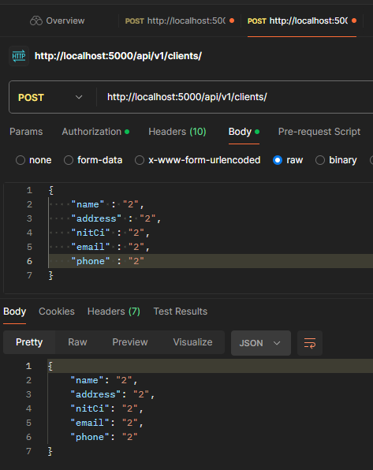
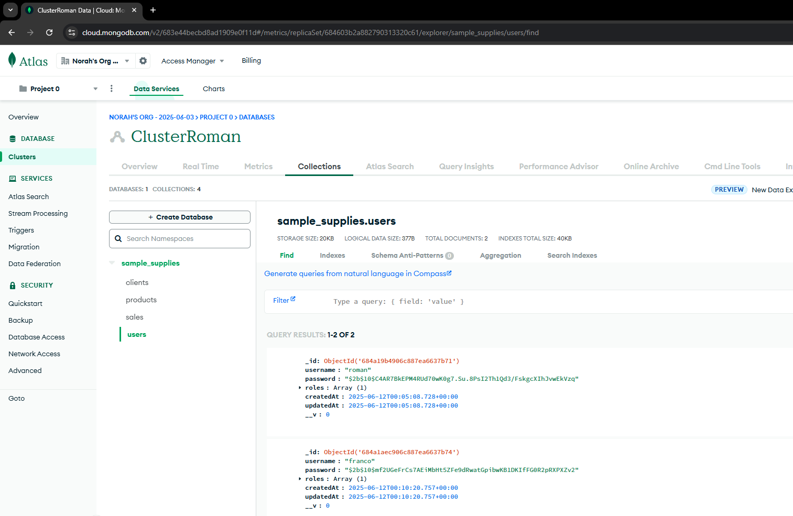

# backend-ecommerce

## Cambios agregados
Creacion de entidad "Client", agregado en todas las capas


**iniciar postman**
Se envian los datos para que inserte en la base de datos



**Base de datos MongoDB**



**Proyecto educativo**: Este repositorio contiene el backend de una aplicación de comercio electrónico, desarrollado con Node.js y Express. Está diseñado con fines educativos para comprender la estructura y funcionamiento de una API RESTful en un entorno de comercio electrónico.

## Requisitos previos

Antes de comenzar, asegúrate de tener instalado lo siguiente en tu entorno de desarrollo:

* [Node.js](https://nodejs.org/) (versión 14 o superior)
* [npm](https://www.npmjs.com/) (gestor de paquetes de Node.js)
* [MongoDB](https://www.mongodb.com/) (base de datos NoSQL)

## Instalación

Sigue estos pasos para configurar y ejecutar el proyecto en tu máquina local:

1. **Clona el repositorio:**

   ```bash
   git clone https://github.com/loquendo2309/backen-ecommerce.git
   cd backen-ecommerce
   ```

2. **Instala las dependencias:**

   ```bash
   npm install
   ```

3. **Configura las variables de entorno:**

   * Crea un archivo `.env` en la raíz del proyecto.
   * Copia el contenido del archivo `.envexample` proporcionado en el repositorio.
   * Reemplaza los valores de las variables según tu configuración local. Por ejemplo:

     ```env
     PORT=3000
     MONGODB_URI=mongodb://localhost:27017/ecommerce
     JWT_SECRET=tu_clave_secreta
     ```

4. **Inicia el servidor:**

   ```bash
   npm start
   ```

   El servidor debería estar corriendo en `http://localhost:3000`.

## Estructura del proyecto

El proyecto está organizado de la siguiente manera:

```
backen-ecommerce/
├── src/
│   ├── controllers/
│   ├── models/
│   ├── routes/
│   ├── middlewares/
│   └── index.js
├── .envexample
├── .eslintrc.json
├── .gitignore
├── package.json
└── package-lock.json
```

* `controllers/`: Contiene la lógica de negocio para manejar las solicitudes y respuestas.
* `models/`: Define los esquemas de Mongoose para las entidades de la base de datos.
* `routes/`: Define las rutas de la API y las asocia con los controladores correspondientes.
* `middlewares/`: Contiene funciones intermedias para el manejo de errores, autenticación, etc.
* `index.js`: Punto de entrada de la aplicación.

## Tecnologías utilizadas

* **Node.js**: Entorno de ejecución para JavaScript en el servidor.
* **Express**: Framework web para Node.js.
* **MongoDB**: Base de datos NoSQL para almacenar la información de la aplicación.
* **Mongoose**: ODM (Object Data Modeling) para MongoDB y Node.js.
* **JWT (JSON Web Tokens)**: Para la autenticación y autorización de usuarios.
* **dotenv**: Para manejar variables de entorno.

## Contribuciones

Este proyecto es de código abierto y está abierto a contribuciones. Si deseas colaborar:

1. Haz un fork del repositorio.
2. Crea una nueva rama (`git checkout -b feature/nueva-funcionalidad`).
3. Realiza tus cambios y haz commits descriptivos.
4. Envía un pull request detallando los cambios realizados.

## Licencia

Este proyecto es de tipo educativo 
